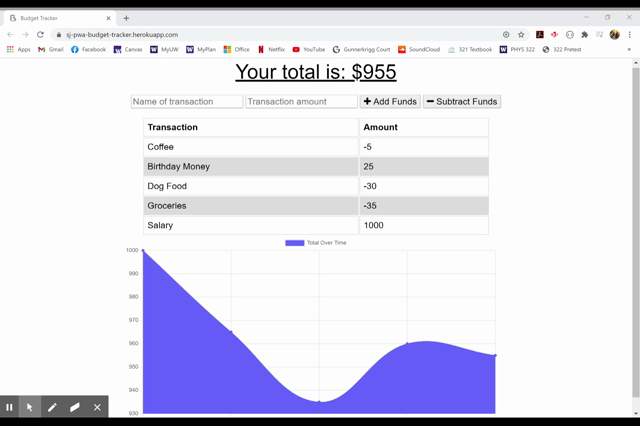

# MongoDB Fitness Tracker
 

## Description
This application allows users to track their budget through their profits and expenditures. This is also a Progressive Web App (PWA), so it can be used offline and downloaded as a desktop icon application. It uses a MongoDB and deploys via Heroku and Mongo Atlas. 

## Table Of Contents
- [Access and Installation](#Access-and-Installation)
- [Usage](#Usage)
- [Features](#Features)
- [License](#License)
- [Contribution Guidelines](#Contribution-Guidelines)
- [Test Instructions](#Test-Instructions)
- [Questions](#Questions)

## Access and Installation

No external software or servers are necessary to install this project except for a text editor and a working browser. You can git clone this repository to your local computer and open the code files using a text editor. Once the correct npm packages are installed, the program can be run from the command line as long as you are in the same directory as the code files. The repository includes the package.json file needed to install the correct npm pacakges/dependencies. 

This project can be accessed either via the GitHub Repository.

- [GitHub Repository](https://github.com/sophia2798/offline_budget_tracker)
- [Deployed Page](https://sj-pwa-budget-tracker.herokuapp.com/)

To open and edit code files, you will need a text editor. The one used to create this page was Visual Studio Code (https://code.visualstudio.com/).

To install this repository, you can git clone the repository using the green "Code" button. You can copy and paste either the HTML or SSH URL.

If you only wish to use the application without editing it or examining the code, you can just visit the "Deployed Page" link above.

## Usage
This project can be used to track your budget by adding or subtracting funds, which updates a MongoDB database. Its additional functionality as a PWA allows users to also access the database information offline and continue to track their budget/use the application.

This project also utilizes MongoDB and functions as PWA. It can therefore be used to study manifest and service-worker files and the usage of MongoDB with Heroku deployment. 

## Features
This project includes...

- The ability for a user to add a an expenditure/profit

- A dyanmically updated graph that visually tracks the budget history of the user

- The ability to download an offline version of the application

## License
MIT
A short and simple permissive license with conditions only requiring preservation of copyright and license notices. Licensed works, modifications, and larger works may be distributed under different terms and without source code.

## Contribution Guidelines
Currently, this repository is not set up for contributions. A development branch, to which all merges can be made while protecting the master branch, must be made first. Therefore, please contact the owner(s) of this repository to start and manage such a branch.

Please ensure that PRIOR to any new contributions, you discuss your desired/planned changes via email with the owner(s) of the repository. Contact information can be found in the [Questions](#Questions) section. Changes should be reflected in an updated README as well. To ensure a high quality of code and minimal conflicts, pull requests can only be merged after being approved by another developer. 

To ensure a welcoming working environment, any contributor to this project must help maintain a harassment-free and safe environment. This includes:
    - Using inclusive language
    - Being respectful of various backgrounds and opinions
    - Accepting constructive criticism without aggression or anger
    - Being aware of what benefits the whole community
    - Showing kindness and empathy to one another

## Test Instructions
As the package.json file exists in this repository, only the following line is needed to install the necessary pacakges

    npm install

To run the program, input the following code into the command line

    npm start

## Questions
If you have any questions, please feel free to reach out to the creators via the GitHub page.

- [Sophia Jung](https://github.com/sophia2798) 